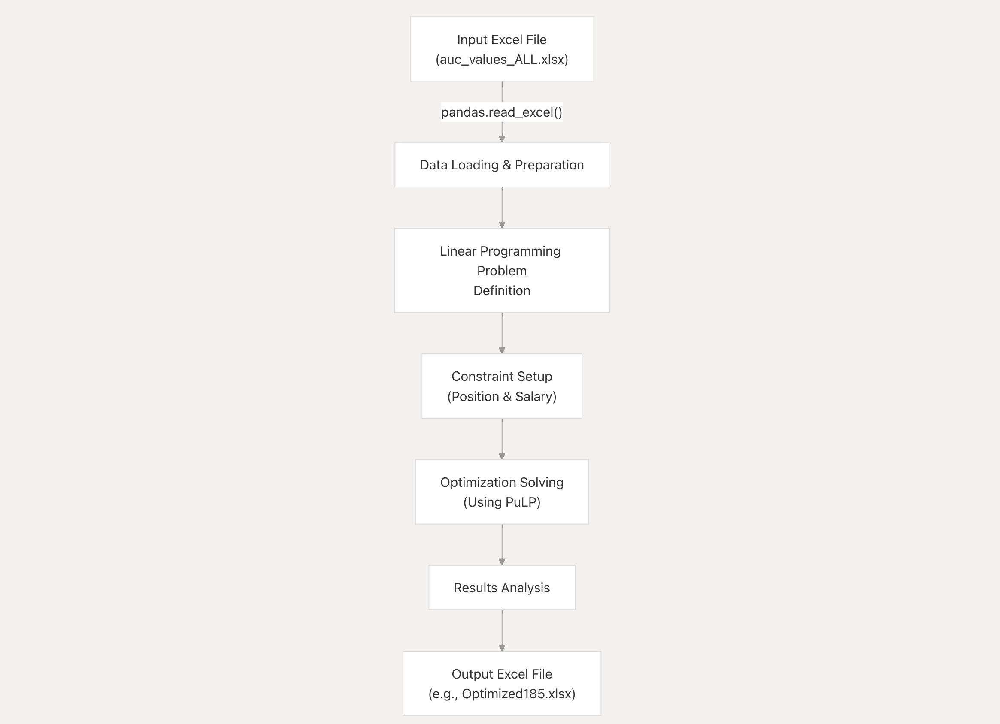
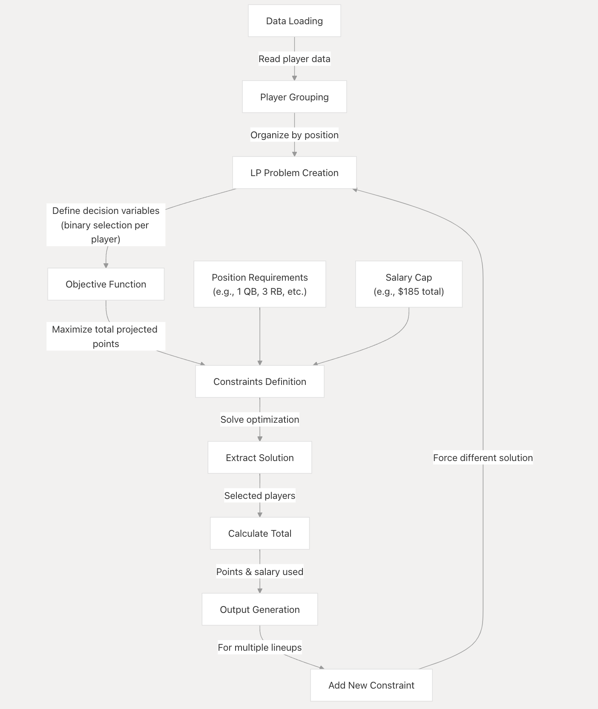
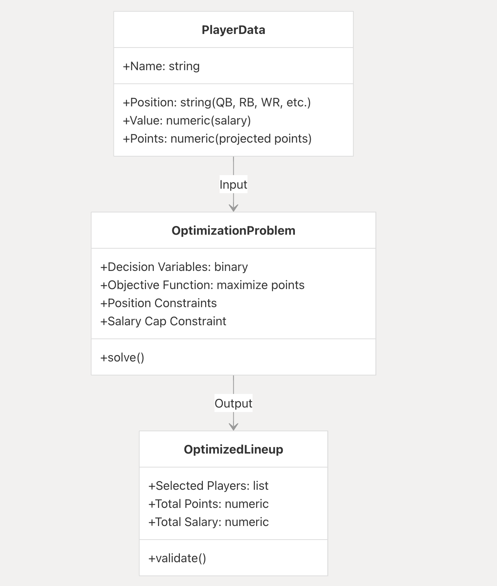
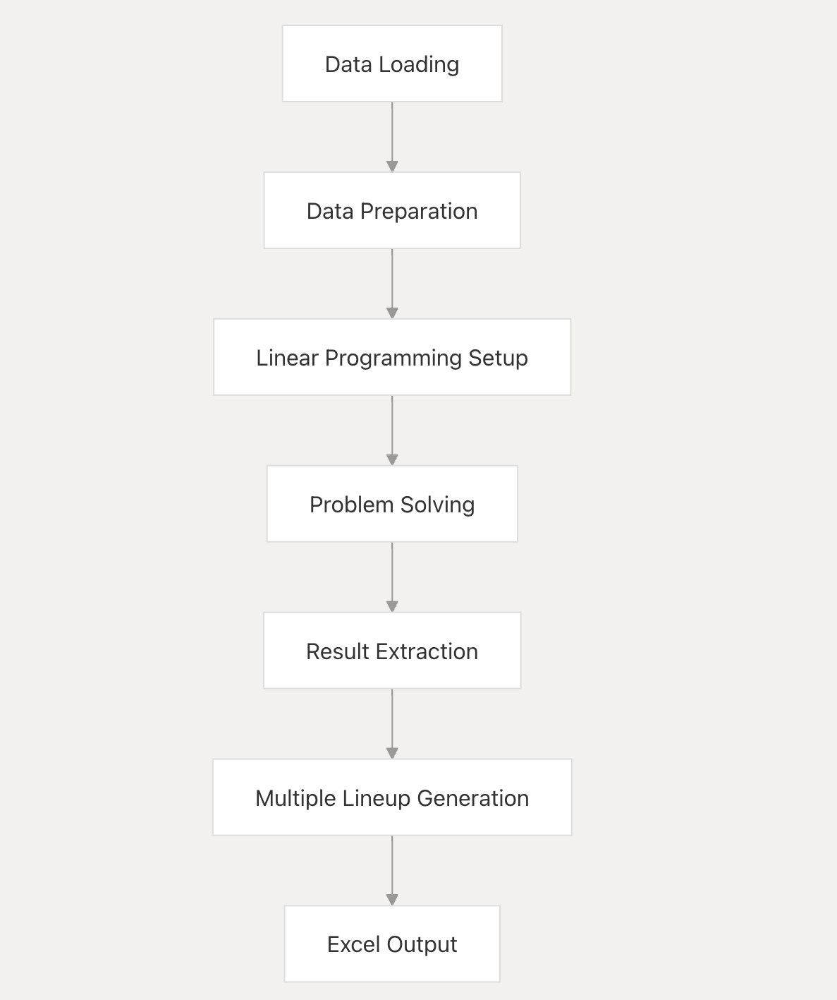

# SalaryCapFantasyFootballDraftOptimizer

The Fantasy Football Salary Cap Draft Optimizer is a tool designed to help fantasy football managers optimize their player selections while adhering to salary cap constraints. It uses linear programming techniques to mathematically determine the optimal combination of players that maximizes projected fantasy points within the constraints of position requirements and a specified salary cap.

This page provides a high-level overview of the system's purpose, architecture, and functionality. 

# Purpose and Key Features
The Fantasy Football Salary Cap Draft Optimizer addresses a common challenge in salary cap fantasy football leagues: selecting the best possible lineup while staying under a salary cap. 

Key features include:
1. Maximization of projected fantasy points
2. Adherence to salary cap constraints
3. Compliance with position requirements
4. Generation of multiple viable lineup alternatives
5. Customizable salary cap values

# System Architecture
The system is built around a single Jupyter notebook that handles the entire optimization process from data loading to solution generation.

# Components and Workflow

# Technology Stack
The system leverages several Python libraries to accomplish its optimization tasks:

**Library	& Purpose**

- pandas - Data loading and manipulation

- PuLP -	Linear programming optimization

- openpyxl - Excel file generation

- plotly.express - Data visualization

# Optimization Process in Detail
The core of the system is the linear programming optimization that selects the best combination of players.

# Optimization Model
The linear programming model can be described as:

Decision Variables: Binary variables (0 or 1) for each player, indicating whether they are selected
Objective Function: Maximize the sum of (projected points × selection decision) for all players
Constraints:
  Position constraints (e.g., exactly 1 quarterback, 3 running backs, etc.)
  Salary cap constraint (sum of selected players' salaries ≤ cap)
  For generating multiple lineups, constraints to force different solutions

# Input Data Structure
The input data is expected to be an Excel file with columns for player values (salaries), projected points, names, and positions.

Example of the input data format:

Value	Name	Pos	Pts
72	Jonathan Taylor	RB	287
63	Derrick Henry	RB	266
55	Dalvin Cook	RB	243
54	Nick Chubb	RB	239
54	Christian McCaffrey	RB	239

# Plotting Data Relationships
The system includes visualization capabilities to plot player value against projected points, helping users to visually assess player value.

# Using the Optimizer

The Optimization Engine processes player data from an Excel file, formulates a linear programming problem, and solves it to find the optimal player selections. It can generate multiple lineup variations by iteratively solving the problem with additional constraints.

The Fantasy Football Salary Cap Draft Optimizer is a Jupyter notebook application that requires the following workflow:

Prepare player data in Excel format with Value, Points, Name, and Position columns
Configure the salary cap and position requirements in the notebook
Run the notebook to generate optimized lineups
Review the output Excel file containing the selected players and lineup statistics
The optimizer allows for multiple lineup variations by iteratively introducing constraints that force the solver to find different combinations of players, providing fantasy football managers with multiple viable draft strategies.

# Conclusion
The Fantasy Football Salary Cap Draft Optimizer provides a powerful mathematical approach to solving the complex problem of maximizing fantasy points while adhering to salary cap constraints and position requirements. By leveraging linear programming techniques, it can generate optimal and near-optimal lineups, giving fantasy football managers data-driven insights for their draft strategy.

View webpage at following link for greater detail: (https://deepwiki.com/nbergeland/SalaryCapFantasyFootballDraftOptimizer#overview)

